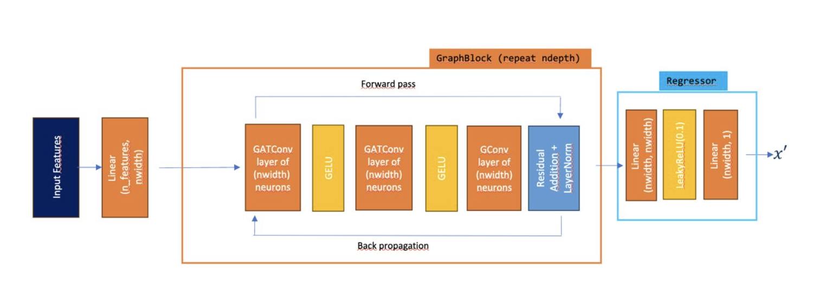

# exaSolver: Exascale Neural Sparse Linear Solver

## Introduction
exaSolver is a scalable, modular, and high-performance neural solver for large sparse linear systems, built on graph neural networks (GNNs) and designed for both local and high-performance computing (HPC) environments. It supports distributed training (DDP/FSDP), robust experiment tracking, and advanced research features such as Jacobi hybrid iterations. 
The current architecture is displayed in the image below, and can be tuned in `L1_exaMLSolver/exa_solver/gnn.py`. 



---

## Features
- **Flexible CLI:** Train, evaluate, export, and tune models with a unified command-line interface.
- **Config-Driven:** YAML configuration for datasets, models, optimizers, and more.
- **Distributed Training:** Out-of-the-box support for multi-GPU and HPC clusters via PyTorch Lightning (DDP/FSDP).
- **Graph-Based:** Designed for graph-structured data and sparse linear systems.
- **Extensible:** Easily add new models, metrics, losses, and data augmentations.
- **Robust Logging:** TensorBoard integration, checkpointing, and experiment versioning.
- **Advanced Research:** Optional Jacobi hybrid iterator for iterative solver research.

---

## Installation

### 1. Create and Activate Environment
```bash
conda create -n exa_solver python=3.9
conda activate exa_solver
```

### 2. Install CUDA
Ensure CUDA 11.8+ is available. On clusters, use your scheduler's module system, e.g.:
```bash
module load CUDA/11.8.0

# confirm cuda
nvcc --version
```

### 3. Install Required Packages
```bash
# PyTorch and CUDA
conda install pytorch=2.1 torchvision torchaudio pytorch-cuda=11.8 -c pytorch -c nvidia

# Core scientific libraries
conda install numpy=1.24 scipy=1.10 pandas=1.5 matplotlib=3.7 scikit-learn=1.3 pyyaml=6.0

# PyTorch Geometric ecosystem
pip install torch-scatter -f https://data.pyg.org/whl/torch-2.1.0+cu118.html
pip install torch-sparse -f https://data.pyg.org/whl/torch-2.1.0+cu118.html
pip install torch-geometric -f https://data.pyg.org/whl/torch-2.1.0+cu118.html

# PyTorch Lightning
pip install pytorch-lightning==2.1

# Hyperparameter optimization
conda install -c conda-forge optuna

# TensorBoard for logging
conda install tensorboard
```

### 4. Verify Installation
```python
import torch
import pytorch_lightning as pl

print(torch.__version__)  # Should print 2.x
print(torch.version.cuda)  # Should print 11.8
print(pl.__version__)  # Should print 2.x

# Run a small test script to ensure FSDP is working
from torch.distributed.fsdp import FullyShardedDataParallel as FSDP
print("FSDP is available:", hasattr(torch.distributed.fsdp, "FullyShardedDataParallel"))
```

---

## Quick Start

### CLI Usage
```bash
python -m exa_solver <command> [arguments]
```

#### Commands
- `train`   : Train a model
- `eval`    : Evaluate a model
- `export`  : Export a trained model for inference
- `optuna`  : Run hyperparameter optimization

#### Help
```bash
python -m exa_solver --help
```

---

## Configuration

All experiments are driven by a YAML configuration file. Example structure:

```yaml
ARCHITECTURE:
  NAME: GNNSolver
  DEPTH: 10
  WIDTH: 32
DATASET:
  AUGMENTATIONS:
    - NAME: JacobiAugmentation
      DEGREE: 20
  TRAIN:
    DIRECTORY: /path/to/train_data
    NUM_MATRICES: -1  # Use all
  TEST:
    DIRECTORY: /path/to/test_data
    NUM_MATRICES: -1
OPTIMIZER:
  NAME: Adam
  BATCH_SIZE: 64
  EPOCHS: 500
  LEARNING_RATE: 0.001
  WEIGHT_DECAY: 0.0
SCHEDULER:
  NAME: MultiStepLR
  GAMMA: 0.8
  MILESTONES: [250, 280]
TEST:
  BATCH_SIZE: 64
CONVERGENCE:
  RTOL: 1e-5
  ATOL: 1e-50
  DTOL: 1e5
  PATIENCE: 3
  MAX_EPOCHS: 50
```

- **ARCHITECTURE:** Model type and parameters.
- **DATASET:** Paths to train/test data and augmentations.
- **OPTIMIZER/SCHEDULER:** Training hyperparameters.
- **CONVERGENCE:** Early stopping and convergence criteria.

---

## Data Preparation
- **Format:** Data should be stored in directories for training and testing, each containing graph-structured sparse matrices and associated features.
- **Required Files:** Each sample should include edge indices (`edge_index`), edge attributes (`edge_attr`), node features (`x`), and target vectors (`y` / `b`).
- **Augmentations:** Specify in config if using (e.g., JacobiAugmentation).
- **Splitting:** Use your own script or symlinks to create train/test splits as needed. See `L1_exaMLSolver/scripts` for useful utility scripts. 

---

## About the Features

### Sparse Matrix Representation
- **`A_values`**: Represents the value in the sparse matrix corresponding to each **(row, column)** index pair in `A_indices` (the `edge_index`).
- **`A_indices`**: Does not represent node features or specific nodes directly—it represents connections (edges) between nodes in the graph (the `edge_attr`).

### Inlet Nodes
- These are specific **nodes** (e.g., rows or columns in the matrix) that correspond to the inflow boundary, and their **features** (such as velocities) are separate from `A_values`.
- **Inlet nodes are implicitly defined** by their position in the sparse matrix (`A_indices`) and their association with features in `b`.
- This is not explicitly labeled in the dataset but is derived from the problem structure.

#### In Practice
- **Inlet nodes** are specific row or column indices in `A_indices` that you identify as being on the inflow boundary.
- **`A_values`** gives the weights or coefficients for connections defined by these indices, but does not define the inlet velocities themselves.

### Adding New Feature Vectors

To further enrich your dataset or model, you may want to add new feature vectors representing additional matrix or graph properties. Common examples include:

- `bandwidth`
- `spectral_radius`
- `condition_number`
- `l1_norm`
- `l2_norm`
- `frobenius_norm`
- `infinity_norm`
- `sparsity`
- `diagonal_dominance_norm`
- `mean_row-wise_diagonal_dominance`

**How to add new features:**
- Compute the desired property for each matrix or graph sample during preprocessing.
- Add the new feature(s) to your node or graph feature vectors in your data pipeline.
- Update your model and configuration to expect and utilize the new feature(s).
- Document any new features in your config and data documentation for clarity.

This extensibility allows exaSolver to adapt to new scientific domains and leverage additional structural information for improved learning and inference.

---

## Training, Evaluation, Export, and Hyperparameter Optimization

### Training
```bash
python -m exa_solver train /path/to/config.yaml [--output-dir /path/to/output] [--checkpoint /path/to/checkpoint.ckpt]
```
- `--output-dir`: Directory for logs and checkpoints (default: ./runs)
- `--checkpoint`: Resume from a previous checkpoint (optional)

### Evaluation
```bash
python -m exa_solver eval /path/to/config.yaml --checkpoint /path/to/model.ckpt
```

### Export
```bash
python -m exa_solver export /path/to/config.yaml --checkpoint /path/to/model.ckpt [--output-path /path/to/exported_model.pt] [--gpu]
```
- Exports a TorchScript model for efficient inference.

### Hyperparameter Optimization
```bash
python -m exa_solver optuna /path/to/config.yaml
```

---

## HPC/Cluster Usage

exaSolver is designed for distributed and HPC environments using DDP/FSDP. Example sbatch script:

```bash
#!/bin/bash
#SBATCH --partition=<partition>
#SBATCH --account=<account>
#SBATCH --time=48:00:00
#SBATCH --mem=480G
#SBATCH --nodes=1
#SBATCH --ntasks-per-node=4
#SBATCH --cpus-per-task=32
#SBATCH --job-name=exa_solver_run
#SBATCH --output=/path/to/logs/exa_solver_%j.log

# Initialize Conda
source <path_to_conda>/etc/profile.d/conda.sh
conda activate exa_solver

# Navigate to project directory
cd /path/to/exa_solver_project

# Run training
srun python -m exa_solver train /path/to/config.yaml --output-dir /path/to/output
```
- Adjust resource parameters as needed for your cluster.
- All logging and checkpoints will be written to the specified output directory.

---

## Logging & Monitoring
- **TensorBoard:**
  - Start TensorBoard locally or on your cluster:
    ```bash
    tensorboard --logdir /path/to/output --port=8008 --bind_all
    ```
  - Access logs and metrics in your browser.
- **Checkpoints:**
  - Best and latest checkpoints are saved in `/path/to/output/checkpoints/`.
  - Use these for resuming training, evaluation, or export.

---

## Evaluation Metrics

exaSolver provides a comprehensive set of evaluation metrics to assess model performance on sparse linear systems. These metrics are logged during training, validation, and testing, and can be visualized with TensorBoard or other tools.

### Core Metrics

- **L1 Distance (`l1_distance`)**
  - Sum of absolute differences between true and predicted values, averaged over all systems.
  - Useful for measuring total error magnitude.

- **L2 Distance (`l2_distance`)**
  - Euclidean (L2) distance between true and predicted values, averaged over all systems.
  - Reflects overall error magnitude and is sensitive to large deviations.

- **L1 Ratio (`l1_ratio`)**
  - Ratio of the L1 norm of the error to the L1 norm of the target, per system.
  - Provides a relative error measure, indicating how large the error is compared to the true solution.

- **L2 Ratio (`l2_ratio`)**
  - Ratio of the L2 norm of the error to the L2 norm of the target, per system.
  - Useful for comparing error magnitude relative to the scale of the solution.

- **Root Mean Square Error (`rmse`)**
  - Square root of the mean squared error between predictions and targets, averaged per system.
  - Commonly used for regression tasks to quantify average prediction error.

- **Vector Angle (`angle`)**
  - Computes the mean angle (in radians) between the predicted and true solution vectors.
  - Useful for understanding directional alignment between solutions.

### Losses

- **Solution Loss (`solution_loss`)**
  - Measures the error between the predicted solution and the true solution vector (e.g., using RMSE or cosine distance).
  - Quantifies how closely the model predicts the actual solution for each batch.

- **Residual Loss (`residual_loss`)**
  - Measures the error between the right-hand side vector `b` and the result of applying the matrix `A` to the predicted solution (`A x_pred`).
  - Indicates how well the predicted solution satisfies the original equation `Ax = b`.

- **Total Loss (`total_loss`)**
  - Sum of solution_loss and residual_loss, providing an overall measure of both solution accuracy and equation satisfaction.

### Normalized Variants
Some metrics may be normalized by:
- The largest diagonal element of the matrix ("normalized_by_diag")
- The Frobenius norm of the matrix ("normalized_by_norm")

These normalized metrics allow for error comparison across systems of different scales.

### Metric Usage
- **Absolute metrics** (L1, L2, RMSE) are useful for understanding the raw error magnitude.
- **Ratio and normalized metrics** provide scale-invariant comparisons, especially important for heterogeneous datasets.
- **Vector angle** is particularly useful for directional problems or when the orientation of the solution is important.
- **Residual loss** is crucial for verifying that the predicted solution actually solves the system, not just that it is numerically close to the ground truth.

---

## Advanced Usage

### Jacobi Hybrid Iterator
- **What:** An optional research feature that alternates GNN and Jacobi iterations for improved convergence.
- **How to Enable:**
  - Replace the standard model and inference modules with those in `jacobi_hybrid_iterator/`.
    - Replace `exa_solver/gnn.py` and `exa_solver/single_inference.py` with `jacobi_hybrid_iterator/gnn.py` and `jacobi_hybrid_iterator/single_inference_jacobi.py` respectively, or modify your config to point to the Jacobi modules if supported.
  - Set `num_jacobi_iters` in your config or model arguments as needed.
- **Note:** This is intended for advanced users and research experiments.

### Custom Models, Losses, Metrics, and Augmentations
- Implement new components in the corresponding module (e.g., `gnn.py`, `losses.py`, `metrics.py`, `augmentations.py`).
- Reference new classes in your config file.

### Hyperparameter Optimization
- Use the `optuna` command to run automated HPO with Optuna.

---

## Developer Guide

### Code Structure
- `exa_solver/` — Core package (models, config, CLI, training logic)
- `jacobi_hybrid_iterator/` — Optional advanced modules for Jacobi hybrid
- `configs/` — Example configuration files
- `scripts/` — Utility scripts 

### Extending exaSolver
- Add new models to `gnn.py`.
- Add new losses or metrics to their respective modules.
- Add new data augmentations in `augmentations.py`.
- Update config files to use new components.

---

## FAQ & Troubleshooting

**Q: CUDA or GPU not detected?**
- Ensure CUDA is installed and available (`nvcc --version`).
- Check your environment and PyTorch installation.

**Q: How do I resume training?**
- Use the `--checkpoint` argument with the `train` command.

**Q: Where are logs and checkpoints?**
- In the output directory specified (default: `./runs`).

**Q: How do I run on multiple GPUs or nodes?**
- Adjust sbatch script and config for your cluster. exaSolver auto-detects available GPUs.

**Q: How do I use the Jacobi hybrid iterator?**
- See Advanced Usage section above.

---

## References & Acknowledgements
- Built on PyTorch, PyTorch Lightning, and PyTorch Geometric.
- Contributions and feedback welcome!
- This work builds upon the previous work by Grementieri & Galeone (2022). 

Grementieri, L. and Galeone, P. (2022) Towards Neural Sparse Linear Solvers. arXiv. Available from: https://arxiv.org/abs/2203.06944

For further help, please refer to the code comments, config examples, or open an issue.